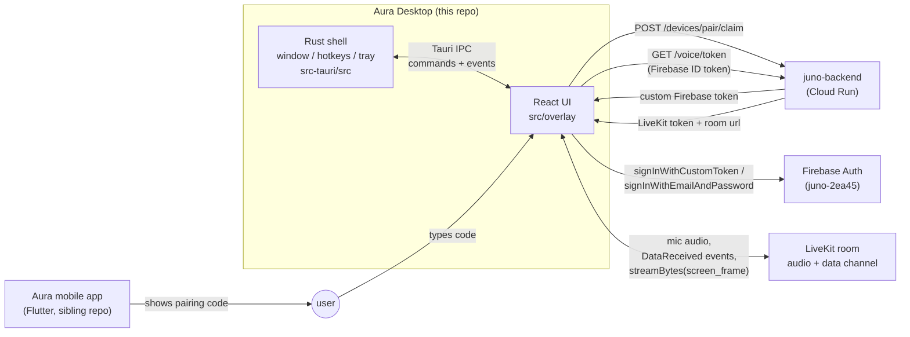
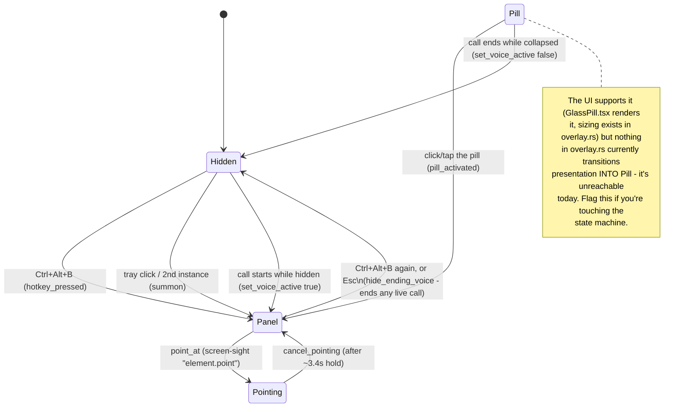
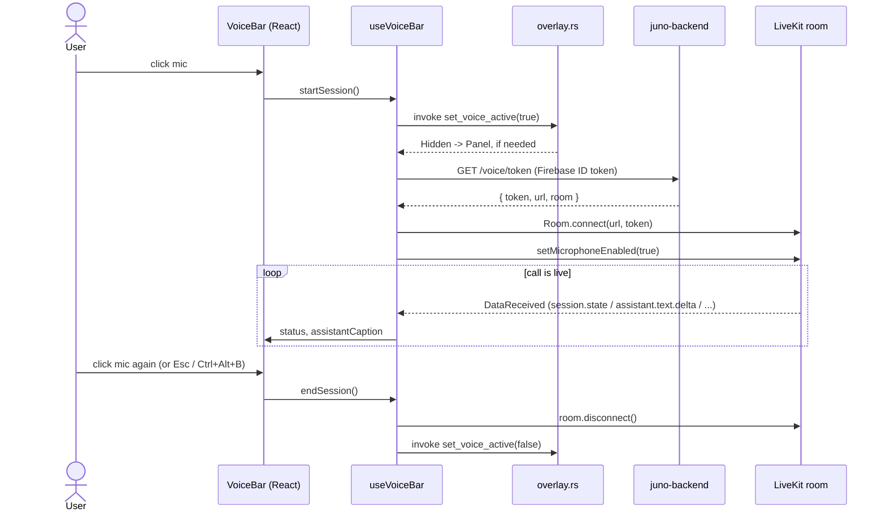
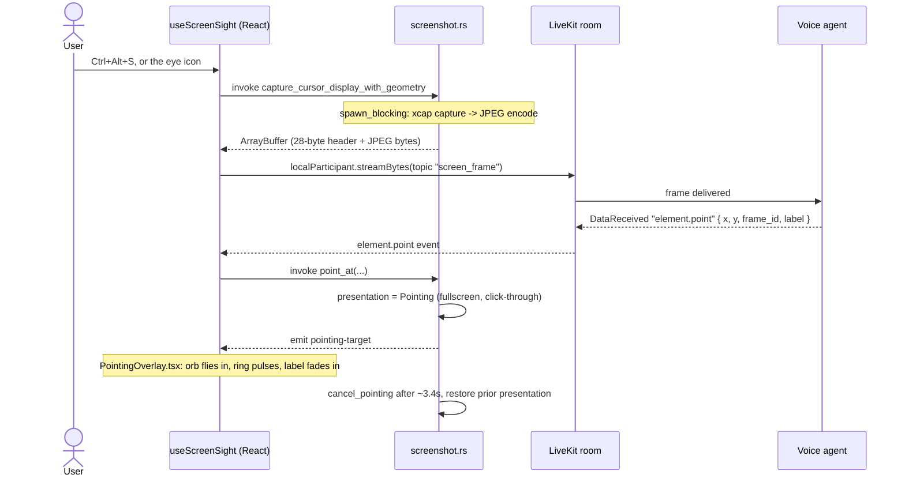
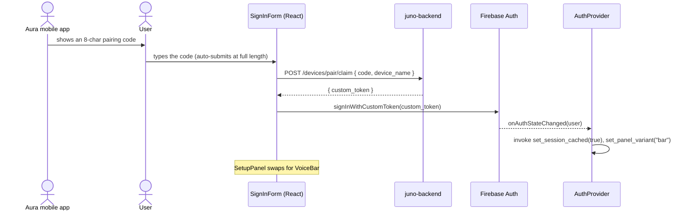

# Aura Desktop

Tauri v2 (Rust) + React 19 (TypeScript) Windows companion app. One borderless, transparent, always-on-top overlay window that resizes itself between a few presentations instead of using separate windows. It's a from-scratch rewrite of the sibling Flutter app (`../Aura`, "Buddy"), talking to the same backend (`juno-backend` on Cloud Run) and Firebase project (`juno-2ea45`).

## System overview



Rust owns the window: geometry, global hotkeys, tray, and stealing OS focus. React owns everything rendered inside it, plus Firebase auth and the LiveKit call. They talk over Tauri's IPC (`invoke` for React-to-Rust calls, `emit`/`listen` for Rust-to-React events).

## Repo layout

**Rust (`src-tauri/src/`)**

| File | Owns |
|---|---|
| `main.rs` | Entry point; hides the console window in release builds |
| `lib.rs` | Tauri builder: plugins, command registration, the `setup()` hook (register hotkeys, build tray, pre-seed panel variant, spawn update check) |
| `overlay.rs` | The state machine: presentation/variant/voice/position, and `apply()` which pushes it onto the real window |
| `hotkeys.rs` | The three global shortcuts and what each one does |
| `win_focus.rs` | `AttachThreadInput` trick to force foreground focus (Windows blocks `SetForegroundWindow` otherwise) |
| `tray.rs` | System tray icon + menu |
| `screenshot.rs` | Screen-sight capture command (async, off the main thread, raw binary IPC response) |
| `auth_cache.rs` | Persisted "has a session" flag, so cold start knows Setup vs. Bar before the webview's own Firebase listener resolves |
| `logging.rs` | File + stdout logging, panic hook |
| `updater.rs` | Checks the GitHub releases feed once at startup |

**React (`src/`)**

| File | Owns |
|---|---|
| `App.tsx` | Mounts `AuthProvider` around `OverlayRoot` |
| `state/AuthProvider.tsx` | Firebase `onAuthStateChanged` listener; mirrors session state into Rust |
| `overlay/OverlayRoot.tsx` | Reads overlay state from Rust, picks which presentation to render |
| `overlay/GlassSurface.tsx` | Shared translucent surface, the whole-window drag region |
| `overlay/SetupPanel.tsx`, `OnboardingFlow.tsx`, `SignInForm.tsx` | Signed-out flow: welcome → QR code → pairing code or email sign-in |
| `overlay/VoiceBar.tsx` | Signed-in bar: mic, screen-sight eye, sign-out |
| `overlay/GlassPill.tsx` | Collapsed "pill" presentation (see note below) |
| `overlay/PointingOverlay.tsx` | PointerBuddy flight animation (orb → ring → label) |
| `overlay/useVoiceBar.ts` | LiveKit `Room` lifecycle + call status state machine |
| `overlay/useScreenSight.ts` | Arm/disarm + capture/stream/point flow |
| `overlay/useEscHotkey.ts` | Esc collapses the overlay |
| `lib/api.ts`, `lib/voice.ts`, `lib/firebase.ts` | Backend and Firebase clients |
| `lib/log.ts` | Durable error logging to the app's log file |

## The overlay state machine



`Panel` also carries a **variant**, `setup` or `bar`, driven by Firebase auth state (`AuthProvider.tsx` calls `set_panel_variant` on every `onAuthStateChanged`, and `lib.rs` pre-seeds it from the cached auth flag at cold start so the first `summon()` sizes the right panel immediately).

## IPC surface

**Commands** (React calls Rust via `invoke("name", { args })`, snake_case params auto-map to camelCase JS args):

| Command | Args | Does |
|---|---|---|
| `current_overlay_state` | – | Returns `{ presentation, panelVariant }` |
| `esc_pressed` | – | Collapses to Hidden, ends any live call |
| `set_voice_active` | `active: bool` | Marks a call live/ended; may flip Hidden ↔ Panel/Pill |
| `set_panel_variant` | `variant: "setup" \| "bar"` | Switches panel content + resizes |
| `set_onboarding_step` | `step: "welcome" \| "getApp" \| "link"` | Tracks onboarding progress in Rust |
| `pill_activated` | – | Pill → Panel |
| `set_session_cached` | `hasSession: bool` | Persists the auth flag used for cold-start panel choice |
| `summon` | – | Bring the panel to front, or open it |
| `point_at` | `targetX, targetY, monitorX, monitorY, monitorW, monitorH, label` | Fullscreen click-through takeover for PointerBuddy |
| `cancel_pointing` | – | Ends the takeover, restores whatever was showing before |
| `capture_cursor_display_with_geometry` | – | Captures the monitor under the cursor as JPEG; async, off the main thread; returns a raw `ArrayBuffer` (28-byte geometry header + JPEG bytes, no base64) |

**Events** (Rust emits, React listens with `listen("name", cb)`):

| Event | Payload | Fired when |
|---|---|---|
| `overlay-changed` | `{ presentation, panelVariant }` | Any state change that goes through `apply()` |
| `end-voice-session` | – | Rust collapses the overlay while a call is live |
| `sign-out-requested` | – | Ctrl+Shift+D |
| `screen-sight-hotkey` | – | Ctrl+Alt+S |
| `pointing-target` | `{ x, y, label }` (window-relative) | `point_at` |

**Over the LiveKit data channel** (backend agent ↔ desktop, JSON, not a Tauri event): `session.ready`, `session.state`, `assistant.text.delta`/`final`, `user.text.delta`/`final`, `error`/`session.error`, `session.ended`, `element.point`.

## Voice session flow



Two client-side watchdogs turn a hung/silent call into a visible error instead of an endless spinner: a 30s join timeout (no `session.ready` yet) and a 15s silence timeout (no text deltas), both in `useVoiceBar.ts`. Every transition into the error state is written to the durable app log (room name + code) via `enterErrorState`, so a repeated failure can be cross-referenced against backend/LiveKit logs after the fact.

## Screen-sight flow



Push-to-look, never ambient: a frame is sent on arm, on `session.ready`, and once per spoken turn while armed - never on a timer or in the background (`useScreenSight.ts`).

## Pairing / sign-in flow



Email/password sign-in is the fallback path in the same `SignInForm`, skipping the pairing/backend hop straight to `signInWithEmailAndPassword`.

## Workflows

Dev loop (you run these yourself - see [`CLAUDE.md`](./CLAUDE.md)):

```
npm run dev          # Vite dev server only, no native window
npm run tauri dev    # full app: Rust + webview, hot reload both sides
npm run build        # tsc && vite build (frontend only)
npm run tauri build  # production bundle + installer + updater artifacts
```

Fast checks (safe to run without asking):

```
cd src-tauri && cargo check   # Rust compiles, no binary produced
npx tsc --noEmit              # TypeScript type-checks
```

Config worth knowing about:
- `src-tauri/tauri.conf.json` - window geometry/decorations, updater endpoint.
- `src-tauri/capabilities/default.json` - the IPC permission allowlist; `http:default` is scoped to `juno-backend`'s origin only, nothing else can be fetched from the webview.

## Known issues / design constraints

See [`CLAUDE.md`](./CLAUDE.md) for the invariants that matter when changing this code (optimistic-cache ordering, main-thread blocking, drag-region rules) and [`lessons-learnt.txt`](./lessons-learnt.txt) for the incident log behind them.
