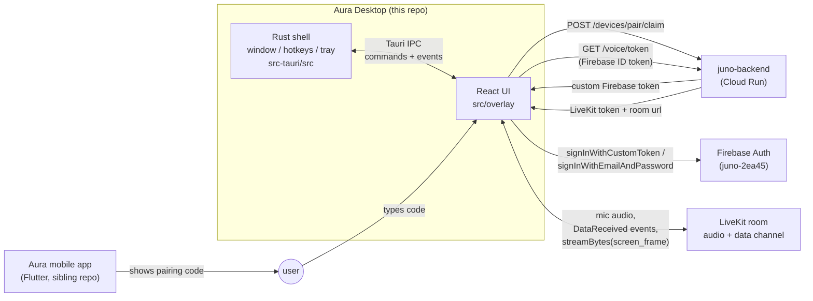
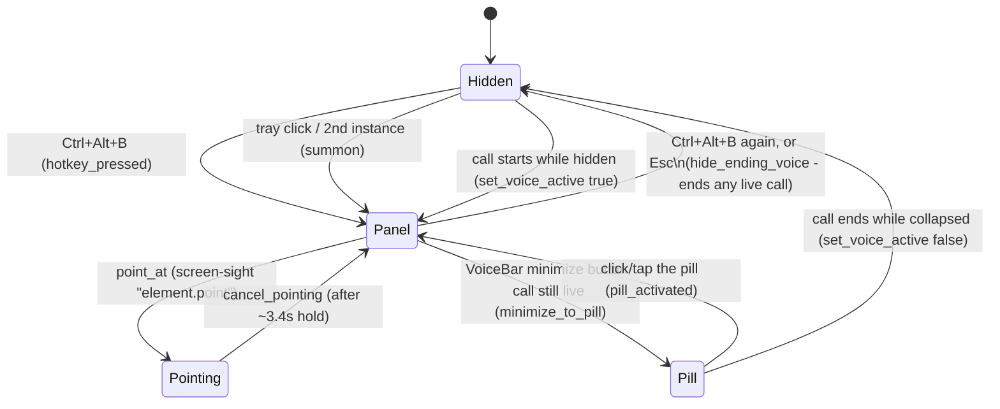
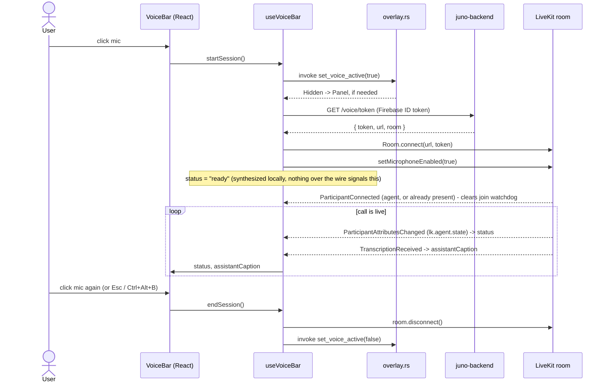
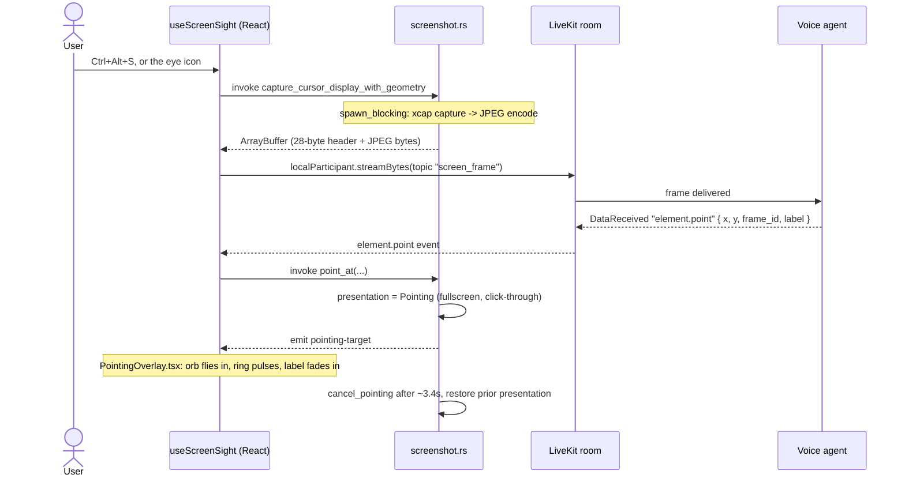
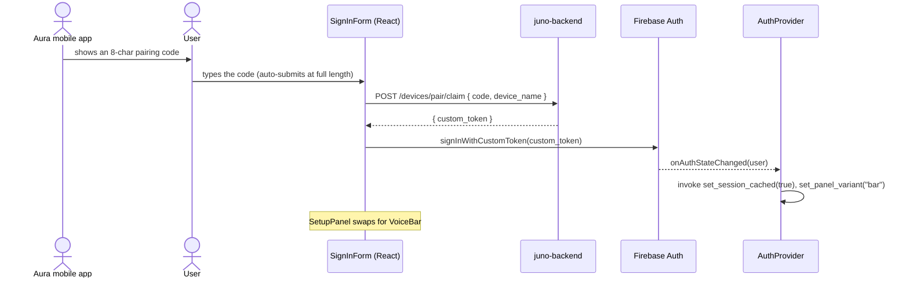
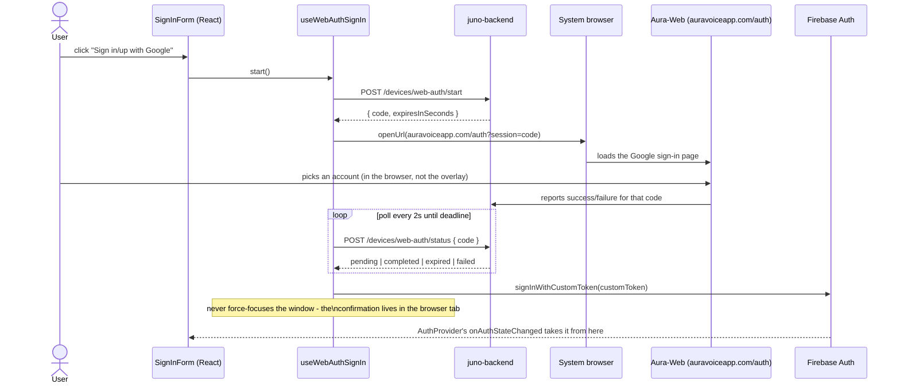

# Aura Desktop

Tauri v2 (Rust) + React 19 (TypeScript) Windows companion app. One borderless, transparent, always-on-top overlay window that resizes itself between a few presentations instead of using separate windows. It's a from-scratch rewrite of the sibling Flutter app (`../Aura`, "Buddy"), talking to the same backend (`juno-backend` on Cloud Run) and Firebase project (`juno-2ea45`).

## System overview



Rust owns the window: geometry, global hotkeys, tray, and stealing OS focus. React owns everything rendered inside it, plus Firebase auth and the LiveKit call. They talk over Tauri's IPC (`invoke` for React-to-Rust calls, `emit`/`listen` for Rust-to-React events).

## Repo layout

**Rust (`src-tauri/src/`)**

| File | Owns |
|---|---|
| `main.rs` | Entry point; hides the console window in release builds |
| `lib.rs` | Tauri builder: plugins, command registration, the `setup()` hook (register hotkeys, apply the launch-at-login policy, build tray, pre-seed panel variant, spawn update check); skips the initial summon when Windows launches the app at login (the autostart entry passes `--autostart`) |
| `overlay.rs` | The state machine: presentation/variant/voice/position, and `apply()` which pushes it onto the real window |
| `hotkeys.rs` | The three global shortcuts and what each one does |
| `win_focus.rs` | Forces foreground focus on Windows via a synthesized Alt tap + `SetForegroundWindow` (Windows denies that call while another app owns focus); plain `set_focus` fallback on non-Windows |
| `tray.rs` | System tray icon + menu: Open Buddy, Open Dashboard, a "Start with Windows" checkbox, version label, update install, quit |
| `screenshot.rs` | Screen-sight capture command (async, off the main thread, raw binary IPC response) |
| `auth_cache.rs` | Persisted "has a session" flag, so cold start knows Setup vs. Bar before the webview's own Firebase listener resolves |
| `autostart.rs` | Launch-at-login policy: on by default, opt-out persisted in `settings.json`, re-asserted on every start (release builds only); keeps the tray checkbox synced to the real registry state |
| `logging.rs` | File + stdout logging, panic hook |
| `sentry_setup.rs` | Rust-side Sentry init (native crash/error reporting; the React side has its own `lib/sentry.ts`) |
| `updater.rs` | Checks the GitHub releases feed once at startup |

**React (`src/`)**

| File | Owns |
|---|---|
| `App.tsx` | Mounts `ErrorBoundary` + `AuthProvider` around `OverlayRoot`; top-level listeners for telemetry consent and the tray's `open-dashboard-requested` event |
| `ErrorBoundary.tsx` | Error boundary around the app root; reports render crashes to Sentry |
| `state/AuthProvider.tsx` | Firebase `onAuthStateChanged` listener; mirrors session state into Rust |
| `overlay/OverlayRoot.tsx` | Reads overlay state from Rust, picks which presentation to render |
| `overlay/GlassSurface.tsx` | Shared translucent surface, the whole-window drag region |
| `overlay/SetupPanel.tsx`, `OnboardingFlow.tsx`, `SignInForm.tsx` | Signed-out flow: welcome → QR code → pairing code, email, or Google sign-in |
| `overlay/useWebAuthSignIn.ts` | Browser-based Google sign-in/sign-up handshake: request a session code, open the system browser to Aura-Web, poll until it completes |
| `overlay/VoiceBar.tsx` | Signed-in bar: mic, screen-sight toggle, minimize-to-pill, dashboard, feedback, sign-out |
| `overlay/BarIconButton.tsx`, `overlay/icons.tsx` | Shared icon-button chrome and the icon set VoiceBar renders it with |
| `overlay/HotkeyHint.tsx` | Renders a keycap + action label pair (used for the hotkey hints shown in the setup flow) |
| `overlay/AvatarPill.tsx` | Collapsed "pill" presentation: Buddy rendered as a 3D character (three.js, lazy-loaded) with an idle animation, instead of the old text bar |
| `overlay/PointingOverlay.tsx` | PointerBuddy flight animation (orb → ring → label) |
| `overlay/useVoiceBar.ts` | LiveKit `Room` lifecycle + call status state machine |
| `overlay/useScreenSight.ts` | Arm/disarm + capture/stream/point flow |
| `overlay/useEscHotkey.ts` | Esc collapses the overlay |
| `lib/api.ts`, `lib/voice.ts`, `lib/firebase.ts`, `lib/firebaseConfig.ts` | Backend and Firebase clients |
| `lib/copy.ts`, `lib/pairingCopy.ts`, `lib/pairingCodeFormat.ts`, `lib/voiceErrorCopy.ts`, `lib/webAuthCopy.ts` | UI copy and formatting, ported verbatim from the Flutter app where applicable |
| `lib/dashboardLink.ts` | Mints a single-use code (`POST /devices/dashboard-link/start`) and opens the web dashboard already signed in; shared by the tray's "Open Dashboard" item and the bar's dashboard button |
| `lib/feedback.ts` | "Send feedback" mail composer: app version, OS, overlay state, and a token-redacted log tail |
| `lib/log.ts` | Durable error logging to the app's log file |
| `lib/sentry.ts` | Sentry init for the webview side (consent-gated, disabled in dev sessions) |
| `lib/analytics.ts` | PostHog event tracking (plain HTTP POST, same project as the Flutter app) |
| `debug/avatarDebug.ts`, `debug/pillDebug.ts` | Standalone Vite pages (`debug-avatar.html`, `debug-pill.html`) for iterating on `AvatarPill.tsx`'s loader/camera code outside Tauri - see [`CLAUDE.md`](./CLAUDE.md) |

## The overlay state machine



`Panel` also carries a **variant**, `setup` or `bar`, driven by Firebase auth state (`AuthProvider.tsx` calls `set_panel_variant` on every `onAuthStateChanged`, and `lib.rs` pre-seeds it from the cached auth flag at cold start so the first `summon()` sizes the right panel immediately).

## IPC surface

**Commands** (React calls Rust via `invoke("name", { args })`, snake_case params auto-map to camelCase JS args):

| Command | Args | Does |
|---|---|---|
| `current_overlay_state` | – | Returns `{ presentation, panelVariant }` |
| `esc_pressed` | – | Collapses to Hidden, ends any live call |
| `set_voice_active` | `active: bool` | Marks a call live/ended; may flip Hidden ↔ Panel/Pill |
| `set_panel_variant` | `variant: "setup" \| "bar"` | Switches panel content + resizes |
| `set_onboarding_step` | `step: "welcome" \| "getApp" \| "link"` | Tracks onboarding progress in Rust |
| `pill_activated` | – | Pill → Panel |
| `minimize_to_pill` | – | Panel → Pill, only while a call is live |
| `set_session_cached` | `hasSession: bool` | Persists the auth flag used for cold-start panel choice |
| `summon` | – | Bring the panel to front, or open it |
| `point_at` | `targetX, targetY, monitorX, monitorY, monitorW, monitorH, label` | Fullscreen click-through takeover for PointerBuddy |
| `cancel_pointing` | – | Ends the takeover, restores whatever was showing before |
| `capture_cursor_display_with_geometry` | – | Captures the monitor under the cursor as JPEG; async, off the main thread; returns a raw `ArrayBuffer` (28-byte geometry header + JPEG bytes, no base64) |

**Events** (Rust emits, React listens with `listen("name", cb)`):

| Event | Payload | Fired when |
|---|---|---|
| `overlay-changed` | `{ presentation, panelVariant }` | Any state change that goes through `apply()` |
| `end-voice-session` | – | Rust collapses the overlay while a call is live |
| `sign-out-requested` | – | Ctrl+Shift+D |
| `screen-sight-hotkey` | – | Ctrl+Alt+S |
| `pointing-target` | `{ x, y, label }` (window-relative) | `point_at` |
| `open-dashboard-requested` | – | Tray "Open Dashboard" click; `App.tsx` responds by minting a dashboard link and opening the browser |

**Over the LiveKit data channel** (backend agent → desktop, JSON, not a Tauri event): only
`error`/`session.error`, `element.point`, and `screen_save.created` (a saved-screen-item
confirmation, shown briefly as a "Saved to ..." caption in the bar) are ever actually sent -
confirmed by grepping every `publish_data` call in the backend. Everything else voice state comes from native LiveKit
primitives, not the data channel - see below.

## Voice session flow

Join detection, agent state, and captions all ride on native LiveKit signals, not a custom JSON
protocol - `useVoiceBar.ts` used to wait for backend-sent `session.ready`/`session.state`/
`assistant.text.*`/`user.text.*` messages that are never actually published (dead code in the
backend's own `protocol.py`), which is why the join watchdog would eventually fire no matter how
long the timeout was. The real signals:

- **Agent joined**: `RoomEvent.ParticipantConnected` where `participant.isAgent` - plus an explicit
  scan of `room.remoteParticipants` right after `connect()` resolves, since that event does not
  fire retroactively for a participant already in the room (which the agent usually is, having
  joined within ~1s of the room being created).
- **Agent state** (listening/thinking/speaking): `RoomEvent.ParticipantAttributesChanged` reading
  the `lk.agent.state` participant attribute.
- **Captions**: `RoomEvent.TranscriptionReceived` (LiveKit's native transcription/text-stream
  feature).
- **Agent produced real output**: the agent's audio track subscribing (`RoomEvent.TrackSubscribed`,
  which is also where `track.attach()` happens so it's actually audible) or a transcription
  segment - either clears the silence watchdog.



Two client-side watchdogs turn a hung/silent call into a visible error instead of an endless
spinner: a 30s join timeout (no agent participant yet) and a 15s silence timeout (no track/
transcription activity), both in `useVoiceBar.ts`. Every transition into the error state is
written to the durable app log (room name + code) via `enterErrorState`, so a repeated failure
can be cross-referenced against backend/LiveKit logs after the fact. A failed call also
auto-retries with exponential backoff (2s/4s/8s, 3 attempts, skipped for mic-access errors that
need the user to fix something in OS settings) before falling back to the manual "tap to retry"
UI, and every session-lifecycle event (`voice_session_started`, `voice_first_response`,
`voice_error`, `voice_retry_attempt`/`voice_retry_exhausted`, `voice_session_ended`) is reported to
PostHog via `src/lib/analytics.ts` - the same project the Flutter app reports to.

## Screen-sight flow



Push-to-look, never ambient: a frame is sent on arm, on `session.ready`, and once per spoken turn while armed - never on a timer or in the background (`useScreenSight.ts`).

When the agent saves something it saw (a `screen_save.created` data-channel message), the bar's caption shows a brief "Saved to ..." confirmation before yielding back to the normal caption (`useScreenSight.ts` feeding `VoiceBar.tsx`).

## Pairing / sign-in flow



Email/password sign-in is a second path in the same `SignInForm`, skipping the pairing/backend hop straight to `signInWithEmailAndPassword`.

A third path, "Sign in/up with Google," is a device-authorization-style handshake spanning three repos - Aura-Desktop opens the browser and polls, `juno-backend` issues and tracks the session code, and Aura-Web hosts the actual Google sign-in page:



The desktop side never touches Google credentials directly - `pollWebAuthStatusOnce` only ever sees a terminal status (`completed`/`expired`/`failed`/`not_found`) or a Firebase custom token, the same posture as `claimPairingCode`. This flow spans three independently-deployed repos, which has its own failure mode - see [`CLAUDE.md`](./CLAUDE.md).

## Workflows

Dev loop (you run these yourself - see [`CLAUDE.md`](./CLAUDE.md)):

```
npm run dev          # Vite dev server only, no native window
npm run tauri dev    # full app: Rust + webview, hot reload both sides
npm run build        # tsc && vite build (frontend only)
npm run tauri build  # production bundle + installer + updater artifacts
```

Fast checks (safe to run without asking):

```
cd src-tauri && cargo check   # Rust compiles, no binary produced
npx tsc --noEmit              # TypeScript type-checks
```

CI (`.github/workflows/ci.yml`) runs those same two checks plus dependency audits (`npm audit --audit-level=high`, `cargo audit`) on every PR and push to `main`; `release.yml` builds and publishes tagged releases.

### Regenerating the avatar model

`src/assets/models/buddy.glb` (the model `AvatarPill.tsx` loads) is a committed, optimized build artifact, not something edited directly. Its source lives in `Avatars/` at the repo root (gitignored - large FBX/intermediate GLB files, not meant for git). To regenerate after a source change:

1. Convert FBX → GLB with [`FBX2glTF`](https://github.com/facebookincubator/FBX2glTF) (`--binary --pbr-metallic-roughness`) if starting from a raw `.fbx`, or skip straight to step 2 if already GLB with animations merged in.
2. Optimize with `@gltf-transform/cli`: `gltf-transform optimize <in>.glb buddy.glb --compress draco --texture-size 1024 --texture-compress webp` (add `--simplify false` if the mesh is already decimated - re-simplifying an already-decimated mesh degrades it further for no reason).
3. Sanity-check with `gltf-transform inspect buddy.glb` before committing - confirm the animation clips you expect are actually present with a real (non-zero) duration, not just a bind pose. A tool's own conversion log isn't proof of this; the last time this ran, `FBX2glTF`'s log line looked fine but the baked "animation" was actually a single static frame.
4. Copy the result to `src/assets/models/buddy.glb`.

`AvatarPill.tsx` plays whichever clip is named `"Idle"`, falling back to the first clip in the file if none matches.

Config worth knowing about:
- `src-tauri/tauri.conf.json` - window geometry/decorations, updater endpoint.
- `src-tauri/capabilities/default.json` - the IPC permission allowlist; `http:default` only allows fetches to `juno-backend` and PostHog's capture endpoint (`us.i.posthog.com`, used by `lib/analytics.ts`), nothing else can be fetched from the webview. The Google sign-in flow's browser leg goes through `opener:default` (`openUrl`, opens the system browser) instead, which isn't subject to this scope at all.
- `src-tauri/.cargo/audit.toml` - `cargo audit` advisory ignores, each with a written justification and the condition for removing it.

## Project docs

| Doc | What it's for |
|---|---|
| [`BETA_ONBOARDING.md`](./BETA_ONBOARDING.md) | Beta tester getting-started: install, pairing, hotkeys, sending feedback |
| [`SMOKE_TEST.md`](./SMOKE_TEST.md) | Manual pre-release smoke test, run in full before every tagged release |
| [`ROLLBACK_RUNBOOK.md`](./ROLLBACK_RUNBOOK.md) | What to do when a shipped build breaks: pull the release, fix, fast-follow |
| [`RELEASE_NOTES_TEMPLATE.md`](./RELEASE_NOTES_TEMPLATE.md) | The What's new / Fixed / Known issues shape every GitHub release body uses |
| [`PRIVACY_AUDIT.md`](./PRIVACY_AUDIT.md) | What's persisted under `%APPDATA%`, what survives uninstall, and the open Firebase-persistence decision |
| [`LEGAL_ADDENDUM_DRAFT.md`](./LEGAL_ADDENDUM_DRAFT.md) | Draft desktop addendum to the ToS/Privacy Policy, pending legal review |
| [`DASHBOARD_PLAN.md`](./DASHBOARD_PLAN.md) | The three-repo web dashboard plan (this repo's side shipped in v0.1.5) |
| [`todo.txt`](./todo.txt) | Living beta-to-GA readiness checklist, updated as items land |
| [`lessons-learnt.txt`](./lessons-learnt.txt) | Incident log: every non-obvious bug and the rule it produced |
| [`CLAUDE.md`](./CLAUDE.md) | Working instructions for Claude Code in this repo |

## Known issues / design constraints

See [`CLAUDE.md`](./CLAUDE.md) for the invariants that matter when changing this code (optimistic-cache ordering, main-thread blocking, drag-region rules) and [`lessons-learnt.txt`](./lessons-learnt.txt) for the incident log behind them.
