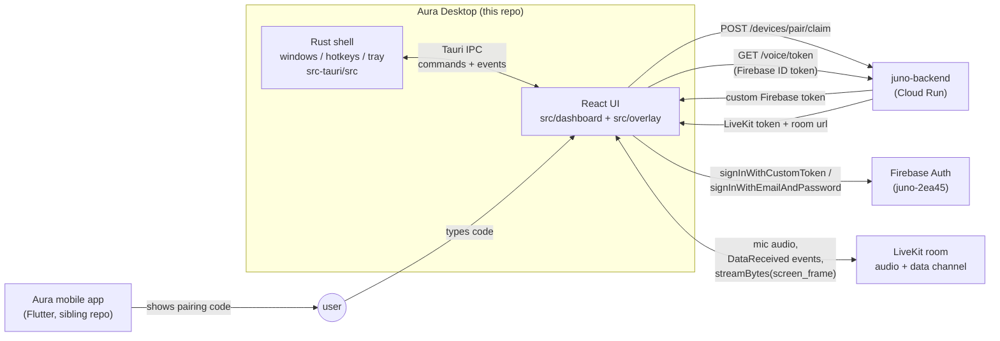
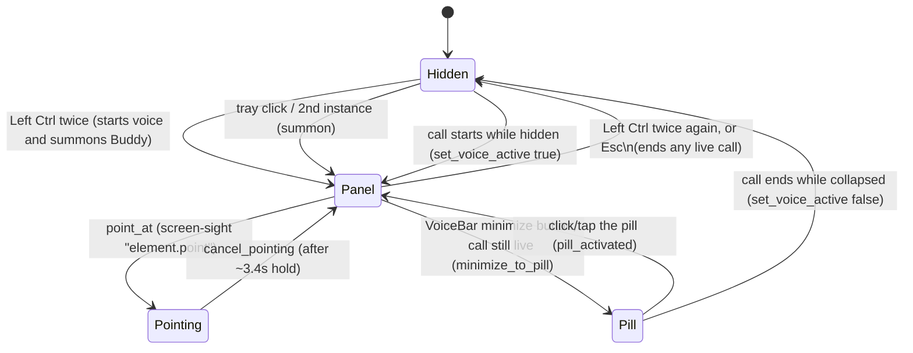
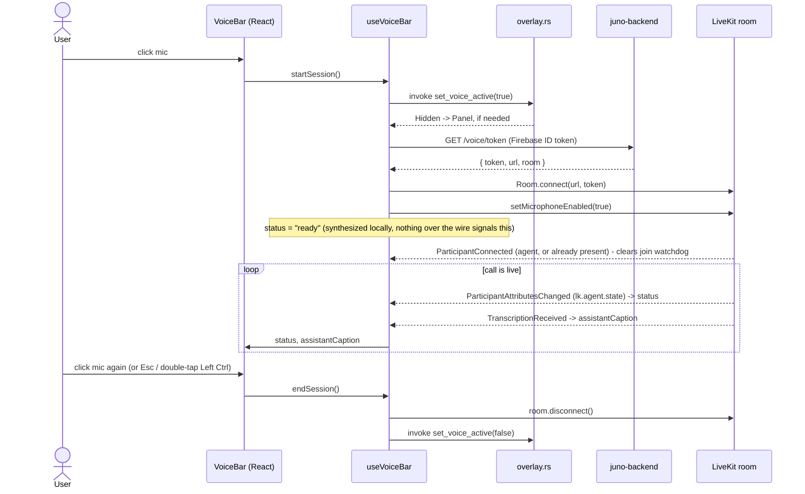
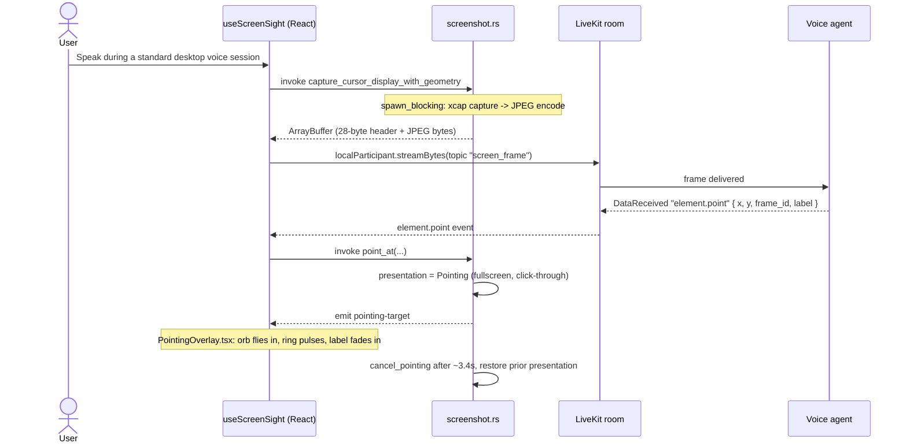
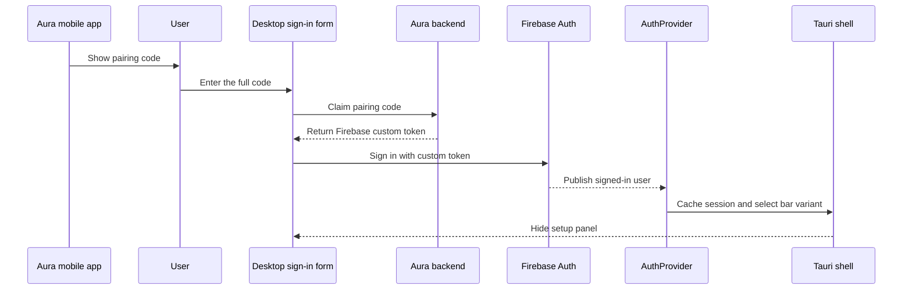
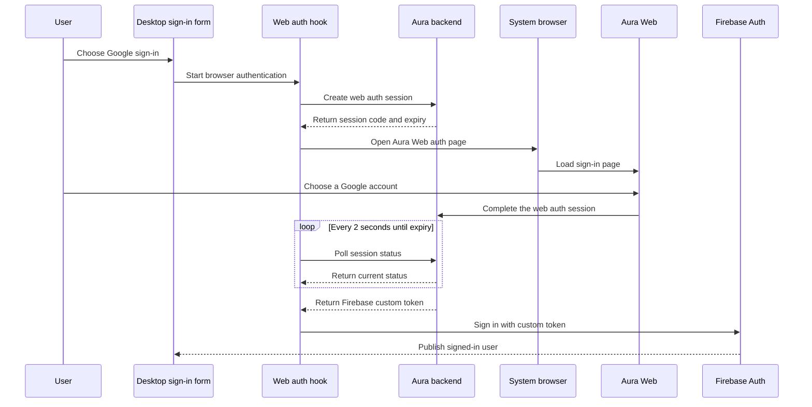

# Aura Desktop

Tauri v2 (Rust) + React 19 (TypeScript) Windows companion app. It has two native windows: the opaque dashboard is the primary app surface, and the borderless transparent overlay remains the signed-in voice companion. It's a from-scratch rewrite of the sibling Flutter app (`../Aura`, "Buddy"), talking to the same backend (`juno-backend` on Cloud Run) and Firebase project (`juno-2ea45`).

## System overview



Rust owns both windows: dashboard creation and focus, overlay geometry, global hotkeys, tray, and foreground handling. React owns the dashboard, overlay rendering, Firebase auth, and the LiveKit call. The dashboard has a read-only Firebase subscription. The hidden main webview keeps the `AuthProvider` side effects that synchronize auth state to Rust. They talk over Tauri IPC (`invoke` for React-to-Rust calls, `emit`/`listen` for cross-window and Rust events).

## App windows

`main` is the transparent, always-on-top overlay used only for signed-in companion interactions. `dashboard` is a decorated, resizable application window with a 720x520 minimum size. `src/main.tsx` routes each webview by its label.

Manual launch, a second instance, and signed-out overlay summons open or focus `dashboard`. First-run onboarding also runs there, guarded by `desktop_onboarding_seen`. A dashboard request to start a conversation emits `start-voice-requested` to `main`; the overlay summons its notch and starts its own `useVoiceBar` session. The dashboard's onboarding demo has a separate `useVoiceBar` instance by design.

## Dashboard data pages (Conversations / Drafts / Saved)

The dashboard's Conversations, Drafts, and Saved pages show the signed-in user's real cross-surface data by calling the **same live `juno-backend` endpoints the Aura-Web dashboard uses** - `GET /history/sessions?since=<ISO>` (+ `/history/sessions/{id}` for a transcript), `GET /drafts`, and `GET /screen-saves` - not the `surface`-filtered `/desktop/*` projections, which exclude data created on mobile/web. No backend changes were needed; auth is the existing `authFetch` (Firebase ID token) in `src/lib/api.ts`. The typed client lives in `src/lib/dashboardApi.ts`.

Fetching is a stale-while-revalidate hook, `src/dashboard/useDashboardResource.ts`: a two-tier cache (in-memory over a versioned on-disk `plugin-store`, `src/lib/dashboardCache.ts`), a freshness gate that skips redundant loads, single-flight de-duplication, a hard request timeout so nothing hangs, and an out-of-order guard so the newest fetch wins. Screen-save `image_url`s are short-lived signed URLs, so they are stripped before caching and only ever rendered from a live fetch.

The UI is a data-driven fixed card shell (`src/dashboard/components/`: `DashboardCard` fed a `CardModel`, `CardGrid` with skeletons and windowed reveal, `DetailModal`, `RangeChips`) rewritten per page under `src/dashboard/pages/`. Cards open a detail popup; Drafts carry platform icons (Gmail / LinkedIn / sparkle) and an in-body copy action; Saved cards open a full-viewport image lightbox and an "open source" link via `openUrl`.

## The overlay state machine



`Panel` also carries a **variant**, `setup` or `bar`, driven by Firebase auth state (`AuthProvider.tsx` calls `set_panel_variant` on every `onAuthStateChanged`, and `lib.rs` pre-seeds it from the cached auth flag at cold start so the first `summon()` sizes the right panel immediately).

## IPC surface

**Commands** (React calls Rust via `invoke("name", { args })`, snake_case params auto-map to camelCase JS args):

| Command | Args | Does |
|---|---|---|
| `current_overlay_state` | – | Returns `{ presentation, panelVariant }` |
| `esc_pressed` | – | Collapses to Hidden, ends any live call |
| `set_voice_active` | `active: bool` | Marks a call live/ended; may flip Hidden ↔ Panel/Pill |
| `set_panel_variant` | `variant: "setup" \| "bar"` | Switches panel content + resizes |
| `set_slot_height` | `height: number \| null` | Grows/shrinks the bar window for the single below-bar slot (Panel+Bar only; the bar's top edge stays fixed and the slot grows downward). OverlayRoot resolves which surface wins the slot (draft > agenda > menu > meeting note > catch-up) and passes the winner's height, or null to collapse |
| `start_meeting_capture` | `meetingId, eventId` | Starts WASAPI mic+loopback capture for a claimed meeting (async; capture runs on dedicated threads) |
| `stop_meeting_capture` | `reason` | Asks the capture engine to flush and finish |
| `capture_status` | – | `{ active, meetingId, eventId, startedAtMs, paused }` |
| `queue_snapshot` | – | The durable upload queue manifest (meetings + segments + upload flags) |
| `read_segment` | `meetingId, seq` | Decrypts one captured segment, returns raw FLAC bytes as an `ArrayBuffer` (the JS upload pump POSTs them to the backend) |
| `mark_segment_uploaded` | `meetingId, seq` | Records a backend-acked segment upload in the manifest |
| `mark_meeting_acked` | `meetingId` | Backend accepted /complete: deletes the meeting's local segment files + manifest entry |
| `start_join_watch` | `eventId, windowStartMs, windowEndMs` | Arms Zoom/Teams join detection for one armed meeting's time window |
| `stop_join_watch` | `eventId` | Disarms a watch |
| `debug_force_join` | `eventId` | Dev builds only: emits `meeting-join-detected` without a detector |
| `set_onboarding_step` | `step: "welcome" \| "getApp" \| "link"` | Tracks onboarding progress in Rust |
| `pill_activated` | – | Pill → Panel |
| `minimize_to_pill` | – | Panel → Pill, only while a call is live |
| `set_session_cached` | `hasSession: bool` | Persists the auth flag used for cold-start panel choice |
| `summon` | – | Bring the panel to front, or open it |
| `point_at` | `targetX, targetY, monitorX, monitorY, monitorW, monitorH, label` | Fullscreen click-through takeover for PointerBuddy |
| `cancel_pointing` | – | Ends the takeover, restores whatever was showing before |
| `capture_cursor_display_with_geometry` | – | Captures the monitor under the cursor as JPEG; async, off the main thread; returns a raw `ArrayBuffer` (28-byte geometry header + JPEG bytes, no base64) |

**Events** (Rust emits, React listens with `listen("name", cb)`):

| Event | Payload | Fired when |
|---|---|---|
| `overlay-changed` | `{ presentation, panelVariant }` | Any state change that goes through `apply()` |
| `end-voice-session` | – | Rust collapses the overlay while a call is live |
| `sign-out-requested` | – | Ctrl+Shift+D |
| `screen-sight-hotkey` | – | Ctrl+Alt+S |
| `pointing-target` | `{ x, y, label }` (window-relative) | `point_at` |
| `open-dashboard-requested` | – | Tray "Open Dashboard" click; `App.tsx` responds by minting a dashboard link and opening the browser |
| `meeting-join-detected` | `{ eventId, app, windowTitle }` | The join detector matched an in-call Zoom/Teams window for an armed meeting |
| `meeting-left` | `{ eventId }` | The matched meeting window disappeared for two consecutive polls |
| `meeting-capture-state` | `{ active, meetingId, eventId, startedAtMs, paused, reason }` | Capture started/stopped/paused (reasons: started, stopped_by_user, meeting_left, max_duration, capture_failed, paused_lock, resumed) |
| `meeting-segment-ready` | `{ meetingId, seq, startMs, durationMs }` | A 5-minute FLAC segment closed and is queued for upload |

**Over the LiveKit data channel** (backend agent → desktop, JSON, not a Tauri event): only
`error`/`session.error`, `element.point`, `screen_save.created` (a saved-screen-item
confirmation, shown briefly as a "Saved to ..." caption in the bar), and the Buddy Drafts
events `draft.generating`/`draft.created`/`draft.updated`/`draft.failed` (consumed by
`useDraftCard.ts`, rendered by `DraftCard.tsx` below the bar) are ever actually sent -
confirmed by grepping every `publish_data` call in the backend. Everything else voice state comes from native LiveKit
primitives, not the data channel - see below.

**Visible artifacts and Buddy Drafts:** email replies and DMs are triggered by voice during a
call with screen-sight armed. The backend drafts from the current screen frame in the user's own
tone (UserAura profile) and pushes the draft over the data channel; the card shows it with
copy-to-clipboard and refine chips (shorter/longer/more formal/warmer/regenerate).
Chips always hit `POST /desktop/draft-outbound/refine` over REST (works during and after the
call - the refine needs only the prior draft plus the model-written context summary, never the
frame). The backend persists the LATEST version of every draft to Firestore
(`UserAura/{uid}/drafts/{draft_id}`, written by the voice worker on create and updated on every
refine - the chip request carries the worker-minted `draft_id` for this) so it shows up in the
web dashboard's Drafts feed, deletable there, auto-expiring 7 days after its last edit via a
Firestore TTL policy. The draft text and its model-written context summary (which is
screen-derived) are what persist; the screen frame itself stays ephemeral, and analytics still
carry channel/length/mode, never text. In dev builds, `window.__injectDraftEvent({...})` (see
`src/debug/draftDebug.ts`) drives the card without a voice call (UI only, nothing persisted).

Commands, code, configuration, prompts for another agent, and multi-step guidance use the same
card but a separate `present_visible_artifact` voice tool. Its `draft.created` event retains
`channel: "snippet"` for old-client compatibility and adds optional `artifact_kind`,
`content_format`, `title`, `language`, and `persisted: false` fields. `content_format: "code"`
preserves exact whitespace and horizontal scrolling. `content_format: "markdown"` supports GFM
headings, lists, task lists, quotes, and fenced code while dropping raw HTML, links, and images.
The backend does not persist these artifacts, does not use the draft quota, and does not log or
analyze their text. If the overlay is hidden or pointing when one arrives, it is summoned after
pointer cleanup so a successfully published artifact cannot remain invisible.

**Meeting Notes** (MEETING_NOTES_PLAN.md, v1): capture is user-armed, never default-on.
A global "Auto meeting notes" toggle (default OFF) plus per-meeting overrides live in the
calendar agenda card (`useMeetingArm.ts`, keyed by uid in `calendar.json`).

**60-minute clamp, for now (product decision 2026-07-11):** meeting notes only supports
meetings up to one hour. Events scheduled longer than 60 minutes (classes, workshops, all-day
blocks with an auto-attached Meet link) are not armable at all rather than silently truncated -
`isEligibleForNotes` in `useMeetingArm.ts` is the gate, the Rust engine hard-stops every
capture at 60 minutes (rejoin-aware: sessions share one per-meeting budget), and the backend
synthesis caps are clamped to 60 on every tier as the defense-in-depth layer. The design
ceilings to restore when long-meeting support lands (4h capture, 240min Pro synthesis) are
documented at each clamp site.

For armed meetings, Rust polls for an in-call window (`meeting/detect.rs`) ONLY
inside the event's own scheduled window, start to end - no lead, no tail - which is exposure
control, not just thrift: detection is not link-matched in v1, so the armed window is also the
window in which an unrelated call could be misattributed to the event. Native Zoom and Teams are
matched by process name plus window title; browser-hosted Google Meet, Teams, and Zoom are matched
by the active browser tab's title (`meeting_app_for_window`). The poller sees only the foreground
tab, so a Meet in a background tab, or a pre-join lobby whose title is not yet "Meet - ...", is not
detected. The kebab menu's "Capture this call" is the manual fallback for a call with no armed
calendar event (an ad-hoc Meet) or one the poller cannot see. On join, `useMeetingCapture.ts`
claims the meeting (`POST /meetings/claim`, monthly cap server-side: 5/month on Free and
Companion, unlimited count on Pro, 402 mirrors the voice-cap shape) and starts
`meeting/audio.rs`: WASAPI mic + render-loopback, both autoconverted to 16 kHz mono, written as
5-minute 2-channel FLAC segments (ch0 = you, ch1 = everyone else), AES-256-GCM encrypted at
rest (DPAPI-wrapped key). A red recording indicator shows in the bar the whole time (tray
tooltip too), capture pauses while the session is locked, and defers any pending update
install. The JS pump uploads segments over REST, sends `/complete`, and the backend synthesizes
(Deepgram nova-3 multichannel + LLM) into `users/{uid}/meetings/{id}` (7-day TTL on non-pro),
deleting the raw audio immediately. The finished note arrives as a below-bar card
(`MeetingNotesCard.tsx`). In dev builds, `window.__meetingDebug.forceJoin("evt-1")` (see
`src/debug/meetingDebug.ts`) drives the whole loop with no Zoom/Teams installed.

## Desktop notifications

`src/lib/desktopNotifications.ts` is the single broker every producer calls: local Rust/JS events
(upload pending, capture ended) and backend events polled from the outbox. It owns a durable inbox,
deduplication, permission state, and a toast-once guarantee (delivered ids persist across restart).
An important event fires one Windows toast plus one durable inbox row. Since 2026-07-21 the toast
shows the notification's real title and body (`toastCopyFor`); it previously showed a generic
privacy-safe line, so meeting titles now reach the Windows lock screen and Action Center. The
contract's `sensitive` flag is the escape hatch to force generic copy again.

Only a meeting that actually started capturing produces a toast: capture-ended, `meeting_upload_pending`,
or the backend's `meeting_ready` after synthesis. A meeting that was never armed, never detected
(Google Meet in a background tab, or started outside its scheduled window), or blocked by the
monthly cap is silent by design - the cap surfaces only as an in-bar caption, not a toast.

## Voice session flow

Join detection, agent state, and captions all ride on native LiveKit signals, not a custom JSON
protocol - `useVoiceBar.ts` used to wait for backend-sent `session.ready`/`session.state`/
`assistant.text.*`/`user.text.*` messages that are never actually published (dead code in the
backend's own `protocol.py`), which is why the join watchdog would eventually fire no matter how
long the timeout was. The real signals:

- **Agent joined**: `RoomEvent.ParticipantConnected` where `participant.isAgent` - plus an explicit
  scan of `room.remoteParticipants` right after `connect()` resolves, since that event does not
  fire retroactively for a participant already in the room (which the agent usually is, having
  joined within ~1s of the room being created).
- **Agent state** (listening/thinking/speaking): `RoomEvent.ParticipantAttributesChanged` reading
  the `lk.agent.state` participant attribute.
- **Captions**: `RoomEvent.TranscriptionReceived` (LiveKit's native transcription/text-stream
  feature).
- **Agent produced real output**: the agent's audio track subscribing (`RoomEvent.TrackSubscribed`,
  which is also where `track.attach()` happens so it's actually audible) or a transcription
  segment - either clears the silence watchdog.



Two client-side watchdogs turn a hung/silent call into a visible error instead of an endless
spinner: a 30s join timeout (no agent participant yet) and a 15s silence timeout (no track/
transcription activity), both in `useVoiceBar.ts`. Every transition into the error state is
written to the durable app log (room name + code) via `enterErrorState`, so a repeated failure
can be cross-referenced against backend/LiveKit logs after the fact. A failed call also
auto-retries with exponential backoff (2s/4s/8s, 3 attempts, skipped for mic-access errors that
need the user to fix something in OS settings) before falling back to the manual "tap to retry"
UI, and every session-lifecycle event (`voice_session_started`, `voice_first_response`,
`voice_error`, `voice_retry_attempt`/`voice_retry_exhausted`, `voice_session_ended`) is reported to
PostHog via `src/lib/analytics.ts` - the same project the Flutter app reports to.

## Screen-sight flow



Standard desktop voice sessions capture the cursor display once per spoken turn (`useTurnScreenCapture.ts`). Ctrl+Alt+G starts or stops Guide Mode: while explicitly active, `useGuideMode.ts` samples the pinned cursor display every two seconds, but Rust's fingerprint detector sends only stable, meaningfully changed frames. The voice agent keeps one pending frame and one hot image in conversation context, then responds through the existing spoken conversation. Guide Mode has no checklist card or Check Now/Stop buttons; the notch shows only a passive green status dot.

When the agent saves something it saw (a `screen_save.created` data-channel message), the bar's caption shows a brief "Saved to ..." confirmation before yielding back to the normal caption (`useScreenSight.ts` feeding `VoiceBar.tsx`).

## Pairing / sign-in flow



Email/password sign-in is a second path in the same `SignInForm`, skipping the pairing/backend hop straight to `signInWithEmailAndPassword`.

A third path, "Sign in/up with Google," is a device-authorization-style handshake spanning three repos - Aura-Desktop opens the browser and polls, `juno-backend` issues and tracks the session code, and Aura-Web hosts the actual Google sign-in page:



The desktop side never touches Google credentials directly - `pollWebAuthStatusOnce` only ever sees a terminal status (`completed`/`expired`/`failed`/`not_found`) or a Firebase custom token, the same posture as `claimPairingCode`. This flow spans three independently-deployed repos, which has its own failure mode - see [`CLAUDE.md`](./CLAUDE.md).

## Workflows

Dev loop (you run these yourself - see [`CLAUDE.md`](./CLAUDE.md)):

```
npm run dev          # Vite dev server only, no native window
npm run tauri dev    # full app: Rust + webview, hot reload both sides
npm run build        # tsc && vite build (frontend only)
npm run tauri build  # production bundle + installer + updater artifacts
```

Fast checks (safe to run without asking):

```
cd src-tauri && cargo check   # Rust compiles, no binary produced
npx tsc --noEmit              # TypeScript type-checks
```

CI (`.github/workflows/ci.yml`) runs those same two checks plus dependency audits (`npm audit --audit-level=high`, `cargo audit`) on every PR and push to `main`; `release.yml` builds and publishes tagged releases.


Config worth knowing about:
- `src-tauri/tauri.conf.json` - window geometry/decorations, updater endpoint.
- `src-tauri/capabilities/default.json` - the IPC permission allowlist; `http:default` only allows fetches to `juno-backend` and PostHog's capture endpoint (`us.i.posthog.com`, used by `lib/analytics.ts`), nothing else can be fetched from the webview. The Google sign-in flow's browser leg goes through `opener:default` (`openUrl`, opens the system browser) instead, which isn't subject to this scope at all.
- `src-tauri/.cargo/audit.toml` - `cargo audit` advisory ignores, each with a written justification and the condition for removing it.

## Project docs

| Doc | What it's for |
|---|---|
| [`BETA_ONBOARDING.md`](./BETA_ONBOARDING.md) | Beta tester getting-started: install, pairing, hotkeys, sending feedback |
| [`SMOKE_TEST.md`](./SMOKE_TEST.md) | Manual pre-release smoke test, run in full before every tagged release |
| [`ROLLBACK_RUNBOOK.md`](./ROLLBACK_RUNBOOK.md) | What to do when a shipped build breaks: pull the release, fix, fast-follow |
| [`RELEASE_NOTES_TEMPLATE.md`](./RELEASE_NOTES_TEMPLATE.md) | The What's new / Fixed / Known issues shape every GitHub release body uses |
| [`PRIVACY_AUDIT.md`](./PRIVACY_AUDIT.md) | What's persisted under `%APPDATA%`, what survives uninstall, and the open Firebase-persistence decision |
| [`LEGAL_ADDENDUM_DRAFT.md`](./LEGAL_ADDENDUM_DRAFT.md) | Draft desktop addendum to the ToS/Privacy Policy, pending legal review |
| [`DASHBOARD_PLAN.md`](./DASHBOARD_PLAN.md) | The three-repo web dashboard plan (this repo's side shipped in v0.1.5) |
| [`todo.txt`](./todo.txt) | Living beta-to-GA readiness checklist, updated as items land |
| [`lessons-learnt.txt`](./lessons-learnt.txt) | Incident log: every non-obvious bug and the rule it produced |
| [`CLAUDE.md`](./CLAUDE.md) | Working instructions for Claude Code in this repo |

## Known issues / design constraints

See [`CLAUDE.md`](./CLAUDE.md) for the invariants that matter when changing this code (optimistic-cache ordering, main-thread blocking, drag-region rules) and [`lessons-learnt.txt`](./lessons-learnt.txt) for the incident log behind them.
