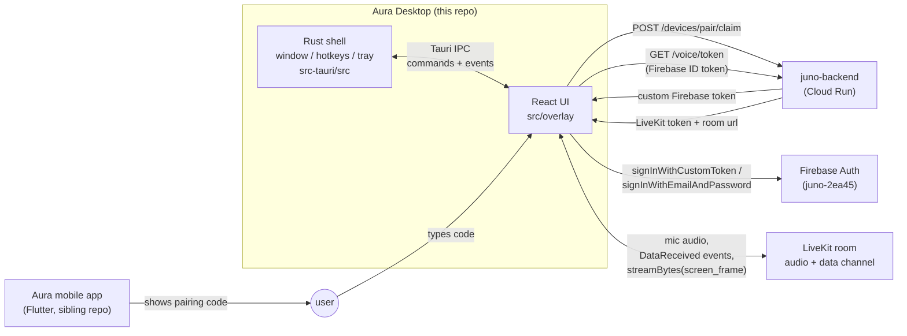
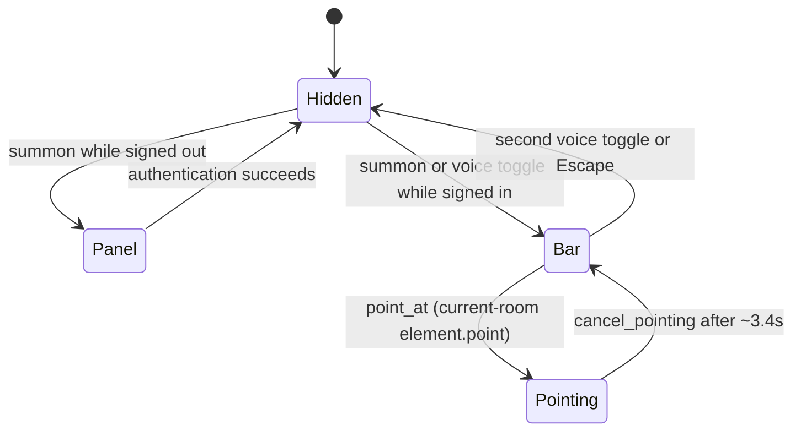
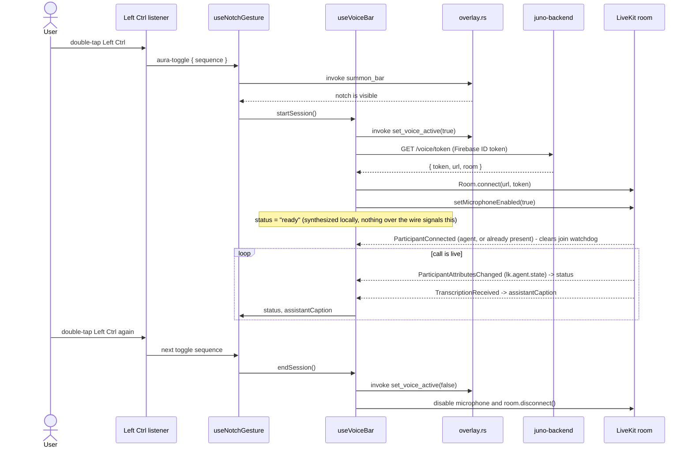
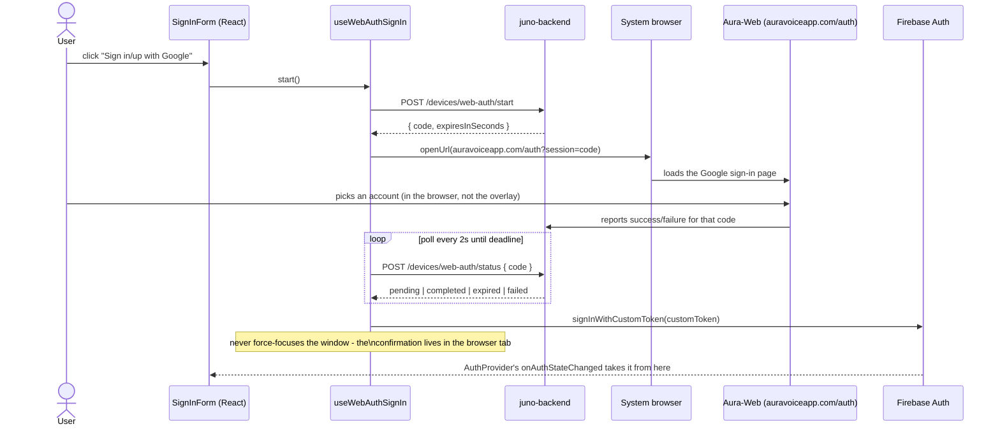

# Aura Desktop

Tauri v2 (Rust) + React 19 (TypeScript) Windows companion app. One borderless, transparent, always-on-top overlay window that resizes itself between a few presentations instead of using separate windows. It's a from-scratch rewrite of the sibling Flutter app (`../Aura`, "Buddy"), talking to the same backend (`juno-backend` on Cloud Run) and Firebase project (`juno-2ea45`).

## System overview



Rust owns the window: geometry, global hotkeys, tray, and stealing OS focus. React owns everything rendered inside it, plus Firebase auth and the LiveKit call. They talk over Tauri's IPC (`invoke` for React-to-Rust calls, `emit`/`listen` for Rust-to-React events).

## Repo layout

**Rust (`src-tauri/src/`)**

| File | Owns |
|---|---|
| `main.rs` | Entry point; hides the console window in release builds |
| `lib.rs` | Tauri builder: plugins, command registration, setup, launch-at-login policy, tray, initial presentation, and update loop |
| `overlay.rs` | The state machine: presentation/variant/voice/position, and `apply()` which pushes it onto the real window |
| `hotkeys.rs` | The three global shortcuts and what each one does |
| `voice_toggle_key.rs` | Windows listener for isolated taps of the key selected by `VOICE_TOGGLE_KEY`; emits a sequenced toggle only after a double-tap and never logs or stores key input |
| `win_focus.rs` | Forces foreground focus on Windows via a synthesized Alt tap + `SetForegroundWindow` (Windows denies that call while another app owns focus); plain `set_focus` fallback on non-Windows |
| `tray.rs` | System tray icon + menu: Open Buddy, Open Dashboard, a "Start with Windows" checkbox, version label, update install, quit |
| `screenshot.rs` | Memory-only screen capture commands (async, off the main thread, raw binary IPC responses) plus one-time cleanup of legacy plaintext turn captures |
| `auth_cache.rs` | Persisted "has a session" flag, so cold start knows Setup vs. Bar before the webview's own Firebase listener resolves |
| `autostart.rs` | Launch-at-login policy: on by default, opt-out persisted in `settings.json`, re-asserted on every start (release builds only); keeps the tray checkbox synced to the real registry state |
| `logging.rs` | File + stdout logging, panic hook |
| `sentry_setup.rs` | Rust-side Sentry init (native crash/error reporting; the React side has its own `lib/sentry.ts`); dev builds init with no DSN, so `tauri dev` crashes never reach the project |
| `updater.rs` | Update lifecycle: checks the GitHub releases feed at startup and every 6 hours, downloads in the background, then gates the install on the user accepting the restart notice and on no voice call being live |

**React (`src/`)**

| File | Owns |
|---|---|
| `App.tsx` | Mounts `ErrorBoundary` + `AuthProvider` around `OverlayRoot`; top-level listeners for telemetry consent and the tray's `open-dashboard-requested` event |
| `ErrorBoundary.tsx` | Error boundary around the app root; reports render crashes to Sentry |
| `state/AuthProvider.tsx` | Firebase `onAuthStateChanged` listener; mirrors session state into Rust |
| `overlay/OverlayRoot.tsx` | Reads overlay state from Rust, picks which presentation to render |
| `overlay/GlassSurface.tsx` | Shared translucent surface, the whole-window drag region |
| `overlay/SetupPanel.tsx`, `OnboardingFlow.tsx`, `SignInForm.tsx` | Signed-out flow: welcome → QR code → pairing code, email, or Google sign-in |
| `overlay/useWebAuthSignIn.ts` | Browser-based Google sign-in/sign-up handshake: request a session code, open the system browser to Aura-Web, poll until it completes |
| `overlay/NotchBar.tsx` | Signed-in notch surface for voice state, captions, errors, capture notices, and update state |
| `overlay/useNotchGesture.ts` | Deduplicates native Left Ctrl double-tap sequences and starts or ends the notch voice session |
| `overlay/BarIconButton.tsx`, `overlay/icons.tsx` | Shared icon-button chrome and the overlay icon set |
| `overlay/HotkeyHint.tsx` | Renders a keycap + action label pair (used for the hotkey hints shown in the setup flow) |
| `overlay/PointingOverlay.tsx` | PointerBuddy flight animation (orb → ring → label) |
| `overlay/useVoiceBar.ts` | LiveKit `Room` lifecycle + call status state machine |
| `overlay/useTurnScreenCapture.ts` | Captures one memory-only frame per spoken turn, streams it to LiveKit, and accepts pointer coordinates only for an exact frame id from the current room |
| `overlay/useMeetings.ts`, `overlay/useMeetingArm.ts`, `overlay/useMeetingCapture.ts` | Background calendar polling, persisted recording consent, Zoom/Teams join watches, encrypted audio capture, upload, completion, and restart recovery |
| `overlay/DraftCard.tsx`, `overlay/useDraftCard.ts` | Visible artifact card rendered below the bar: consumes backward-compatible `draft.*` data-channel events, renders exact code or safe GFM Markdown, exposes copy/refine actions, and drives `set_slot_height` so the window grows for it |
| `overlay/useUpdateReady.ts` | Listens for the Rust `update-ready` event, exposes the "Restart to install vX.Y.Z" state to the bar, and shows the one-time "Updated to vX" caption after a restart |
| `lib/api.ts`, `lib/voice.ts`, `lib/firebase.ts`, `lib/firebaseConfig.ts` | Backend and Firebase clients |
| `lib/copy.ts`, `lib/pairingCopy.ts`, `lib/pairingCodeFormat.ts`, `lib/voiceErrorCopy.ts`, `lib/webAuthCopy.ts` | UI copy and formatting, ported verbatim from the Flutter app where applicable |
| `lib/draft.ts` | Buddy Drafts client contract: the `draft.*` payload types and `POST /desktop/draft-outbound/refine` (mirrors the worker's data-channel payloads) |
| `lib/dashboardLink.ts` | Mints a single-use code (`POST /devices/dashboard-link/start`) and opens the web dashboard already signed in; shared by the tray's "Open Dashboard" item and the bar's dashboard button |
| `lib/feedback.ts` | "Send feedback" mail composer: app version, OS, overlay state, and a token-redacted log tail |
| `lib/log.ts` | Durable error logging to the app's log file |
| `lib/sentry.ts` | Sentry init for the webview side (consent-gated, disabled in dev sessions) |
| `lib/analytics.ts` | PostHog event tracking (plain HTTP POST, same project as the Flutter app) |

## The overlay state machine



`Panel` is signed-out setup. The authenticated resting state is `Hidden`; `Bar` is the signed-in notch revealed by a summon or voice toggle. Firebase auth updates future summon routing through `set_panel_variant`, and successful sign-in hides the setup window. A draft card adds height to the notch window through `set_slot_height`.

## IPC surface

**Commands** (React calls Rust via `invoke("name", { args })`, snake_case params auto-map to camelCase JS args):

| Command | Args | Does |
|---|---|---|
| `current_overlay_state` | – | Returns `{ presentation, panelVariant }` |
| `esc_pressed` | – | Compatibility no-op; React handles Escape by ending voice and dismissing the bar |
| `set_voice_active` | `active: bool` | Mirrors voice activity into native authorization and updater gates |
| `set_panel_variant` | `variant: "setup" \| "companion"` | Routes future summons to signed-out setup or the signed-in bar; an auth change hides the current non-pointing window |
| `set_slot_height` | `height: number \| null` | Adds or removes the draft surface above the notch |
| `voice_toggle_key_status` | – | Returns `{ available, keyLabel, reason? }` for the configured native voice-key listener |
| `start_meeting_capture` | `meetingId, eventId` | Starts WASAPI mic+loopback capture for a claimed meeting (async; capture runs on dedicated threads) |
| `stop_meeting_capture` | `reason` | Asks the capture engine to flush and finish |
| `capture_status` | – | `{ active, meetingId, eventId, startedAtMs, paused }` |
| `queue_snapshot` | – | The durable upload queue manifest (meetings + segments + upload flags) |
| `read_segment` | `meetingId, seq` | Decrypts one captured segment, returns raw FLAC bytes as an `ArrayBuffer` (the JS upload pump POSTs them to the backend) |
| `mark_segment_uploaded` | `meetingId, seq` | Records a backend-acked segment upload in the manifest |
| `mark_meeting_acked` | `meetingId` | Backend accepted /complete: deletes the meeting's local segment files + manifest entry |
| `start_join_watch` | `eventId, windowStartMs, windowEndMs` | Arms Zoom/Teams join detection for one armed meeting's time window |
| `stop_join_watch` | `eventId` | Disarms a watch |
| `debug_force_join` | `eventId` | Dev builds only: emits `meeting-join-detected` without a detector |
| `set_onboarding_step` | `step: "welcome" \| "getApp" \| "link"` | Tracks onboarding progress in Rust |
| `set_session_cached` | `hasSession: bool` | Persists the auth flag used for cold-start panel choice |
| `summon` | – | Reveals setup for signed-out users or the notch bar for signed-in users |
| `summon_bar` | – | Shows the signed-in notch without stealing focus; returns an error if native presentation fails |
| `dismiss_bar` | – | Ends voice, hides the notch, and clears a pointing takeover |
| `point_at` | `targetX, targetY, monitorX, monitorY, monitorW, monitorH, label` | Fullscreen click-through takeover for PointerBuddy |
| `cancel_pointing` | – | Ends the takeover, restores whatever was showing before |
| `capture_cursor_display_with_geometry` | – | Captures the monitor under the cursor as JPEG; async, off the main thread; returns a raw `ArrayBuffer` (28-byte geometry header + JPEG bytes, no base64) |
| `capture_turn_screen_with_geometry` | – | Captures a spoken-turn frame into memory and returns the same geometry header plus JPEG bytes; no screenshot file is written |

**Events** (Rust emits, React listens with `listen("name", cb)`):

| Event | Payload | Fired when |
|---|---|---|
| `overlay-changed` | `{ presentation, panelVariant }` | Any state change that goes through `apply()` |
| `aura-toggle` | `{ sequence }` | A valid Left Ctrl double-tap completes; React deduplicates the sequence |
| `sign-out-requested` | – | Ctrl+Shift+D |
| `screen-sight-hotkey` | – | Legacy Ctrl+Alt+S event; the current React root does not mount a manual screen-sight control |
| `pointing-target` | `{ x, y, label }` (window-relative) | `point_at` |
| `open-dashboard-requested` | – | Tray "Open Dashboard" click; `App.tsx` responds by minting a dashboard link and opening the browser |
| `meeting-join-detected` | `{ eventId, app, windowTitle }` | The join detector matched an in-call Zoom/Teams window for an armed meeting |
| `meeting-left` | `{ eventId }` | The matched meeting window disappeared for two consecutive polls |
| `meeting-capture-state` | `{ active, meetingId, eventId, startedAtMs, paused, reason }` | Capture started/stopped/paused (reasons: started, stopped_by_user, meeting_left, max_duration, capture_failed, paused_lock, resumed) |
| `meeting-segment-ready` | `{ meetingId, seq, startMs, durationMs }` | A 5-minute FLAC segment closed and is queued for upload |

**Over the LiveKit data channel** (backend agent → desktop, JSON, not a Tauri event): only
`error`/`session.error`, `element.point`, `screen_save.created` (a saved-screen-item
confirmation, shown briefly in the notch caption), and the Buddy Drafts
events `draft.generating`/`draft.created`/`draft.updated`/`draft.failed` (consumed by
`useDraftCard.ts`, rendered by `DraftCard.tsx` below the bar) are ever actually sent -
confirmed by grepping every `publish_data` call in the backend. Everything else voice state comes from native LiveKit
primitives, not the data channel - see below.

**Visible artifacts and Buddy Drafts:** email replies and DMs are triggered by voice during a
call. The backend drafts from the current spoken-turn frame in the user's own
tone (UserAura profile) and pushes the draft over the data channel; the card shows it with
copy-to-clipboard and refine chips (shorter/longer/more formal/warmer/regenerate).
Chips always hit `POST /desktop/draft-outbound/refine` over REST (works during and after the
call - the refine needs only the prior draft plus the model-written context summary, never the
frame). The backend persists the LATEST version of every draft to Firestore
(`UserAura/{uid}/drafts/{draft_id}`, written by the voice worker on create and updated on every
refine - the chip request carries the worker-minted `draft_id` for this) so it shows up in the
web dashboard's Drafts feed, deletable there, auto-expiring 7 days after its last edit via a
Firestore TTL policy. The draft text and its model-written context summary (which is
screen-derived) are what persist; the screen frame itself stays ephemeral, and analytics still
carry channel/length/mode, never text. In dev builds, `window.__injectDraftEvent({...})` (see
`src/debug/draftDebug.ts`) drives the card without a voice call (UI only, nothing persisted).

Commands, code, configuration, prompts for another agent, and multi-step guidance use the same
card but a separate `present_visible_artifact` voice tool. Its `draft.created` event retains
`channel: "snippet"` for old-client compatibility and adds optional `artifact_kind`,
`content_format`, `title`, `language`, and `persisted: false` fields. `content_format: "code"`
preserves exact whitespace and horizontal scrolling. `content_format: "markdown"` supports GFM
headings, lists, task lists, quotes, and fenced code while dropping raw HTML, links, and images.
The backend does not persist these artifacts, does not use the draft quota, and does not log or
analyze their text. If the overlay is hidden or pointing when one arrives, it is summoned after
pointer cleanup so a successfully published artifact cannot remain invisible.

**Meeting Notes** (MEETING_NOTES_PLAN.md, v1): capture is user-armed, never default-on.
Consent previously saved by the removed agenda controls remains keyed by uid in `calendar.json`.
`OverlayRoot` mounts the calendar, arm, and capture hooks as background services while keeping
the removed agenda, recording controls, and meeting-note cards out of the notch UI.

**60-minute clamp, for now (product decision 2026-07-11):** meeting notes only supports
meetings up to one hour. Events scheduled longer than 60 minutes (classes, workshops, all-day
blocks with an auto-attached Meet link) are not armable at all rather than silently truncated -
`isEligibleForNotes` in `useMeetingArm.ts` is the gate, the Rust engine hard-stops every
capture at 60 minutes (rejoin-aware: sessions share one per-meeting budget), and the backend
synthesis caps are clamped to 60 on every tier as the defense-in-depth layer. The design
ceilings to restore when long-meeting support lands (4h capture, 240min Pro synthesis) are
documented at each clamp site.

For armed meetings, Rust polls for an in-call Zoom/Teams window (`meeting/detect.rs`) ONLY
inside the event's own scheduled window, start to end - no lead, no tail - which is exposure
control, not just thrift: detection is not link-matched in v1, so the armed window is also the
window in which an unrelated call could be misattributed to the event. Google Meet has no
detector, and its former manual capture control is intentionally not mounted. On a detected
Zoom/Teams join, `useMeetingCapture.ts`
claims the meeting (`POST /meetings/claim`, monthly cap server-side: 5/month on Free and
Companion, unlimited count on Pro, 402 mirrors the voice-cap shape) and starts
`meeting/audio.rs`: WASAPI mic + render-loopback, both autoconverted to 16 kHz mono, written as
5-minute 2-channel FLAC segments (ch0 = you, ch1 = everyone else), AES-256-GCM encrypted at
rest (DPAPI-wrapped key). The tray tooltip carries the recording state; the removed in-window
recording controls are not restored. Capture pauses while the session is locked and defers a pending update
install. The JS pump uploads segments over REST, sends `/complete`, and the backend synthesizes
(Deepgram nova-3 multichannel + LLM) into `users/{uid}/meetings/{id}` (7-day TTL on non-pro),
deleting the raw audio immediately. Finished notes are read in the web dashboard; desktop note
card delivery is intentionally not mounted. In dev builds, `window.__meetingDebug.forceJoin("evt-1")` (see
`src/debug/meetingDebug.ts`) drives the whole loop with no Zoom/Teams installed.

## Voice session flow

Join detection, agent state, and captions all ride on native LiveKit signals, not a custom JSON
protocol - `useVoiceBar.ts` used to wait for backend-sent `session.ready`/`session.state`/
`assistant.text.*`/`user.text.*` messages that are never actually published (dead code in the
backend's own `protocol.py`), which is why the join watchdog would eventually fire no matter how
long the timeout was. The real signals:

- **Agent joined**: `RoomEvent.ParticipantConnected` where `participant.isAgent` - plus an explicit
  scan of `room.remoteParticipants` right after `connect()` resolves, since that event does not
  fire retroactively for a participant already in the room (which the agent usually is, having
  joined within ~1s of the room being created).
- **Agent state** (listening/thinking/speaking): `RoomEvent.ParticipantAttributesChanged` reading
  the `lk.agent.state` participant attribute.
- **Captions**: `RoomEvent.TranscriptionReceived` (LiveKit's native transcription/text-stream
  feature).
- **Agent produced real output**: the agent's audio track subscribing (`RoomEvent.TrackSubscribed`,
  which is also where `track.attach()` happens so it's actually audible) or a transcription
  segment - either clears the silence watchdog.



Left Ctrl used with another key is cancelled as a tap candidate and passes through as a normal shortcut. `VOICE_TOGGLE_KEY` is the single native selector for Left Ctrl, Right Ctrl, or either Ctrl. Voice startup begins only after Rust confirms that the notch is visible. Generation counters in the gesture and voice hooks are checked after notch presentation, token fetch, room connect, and microphone enable, so a second double-tap during startup invalidates the partial room before it can leave the microphone active.

Two client-side watchdogs turn a hung/silent call into a visible error instead of an endless
spinner: a 30s join timeout (no agent participant yet) and a 15s silence timeout (no track/
transcription activity), both in `useVoiceBar.ts`. Every transition into the error state is
written to the durable app log (room name + code) via `enterErrorState`, so a repeated failure
can be cross-referenced against backend/LiveKit logs after the fact. A failed call also
auto-retries with exponential backoff (2s/4s/8s, 3 attempts, skipped for mic-access errors that
need the user to fix something in OS settings) before falling back to the manual "tap to retry"
UI, and every session-lifecycle event (`voice_session_started`, `voice_first_response`,
`voice_error`, `voice_retry_attempt`/`voice_retry_exhausted`, `voice_session_ended`) is reported to
PostHog via `src/lib/analytics.ts` - the same project the Flutter app reports to.

## Screen-sight flow

```mermaid
sequenceDiagram
    actor User
    participant JS as useTurnScreenCapture (React)
    participant Rust as screenshot.rs
    participant LK as LiveKit room
    participant Agent as Voice agent

    User->>JS: begins a spoken turn
    JS->>Rust: invoke capture_turn_screen_with_geometry
    Note over Rust: spawn_blocking: xcap capture -> JPEG encode
    Rust-->>JS: ArrayBuffer (28-byte header + JPEG bytes)
    Note over JS,Rust: frame remains in memory; no screenshot file is written
    JS->>LK: localParticipant.streamBytes(topic "screen_frame")
    LK->>Agent: frame delivered
    Agent-->>LK: DataReceived "element.point" { x, y, frame_id, label }
    LK-->>JS: element.point event
    JS->>Rust: invoke point_at(...)
    Rust->>Rust: presentation = Pointing (fullscreen, click-through)
    Rust-->>JS: emit pointing-target
    Note over JS: PointingOverlay.tsx: orb flies in, ring pulses, label fades in
    Rust->>Rust: cancel_pointing after ~3.4s, restore prior presentation
```

While a voice room is live, the hook sends at most one frame per spoken turn and resets at the next final transcription. Rust rechecks native authorization after capture, and startup maintenance deletes the legacy plaintext `screenshots` directory created by earlier builds.

Geometry is scoped to the current LiveKit room. An `element.point` message must name an exact retained frame id; missing, unknown, or prior-room ids are ignored. Capture failures and `screen_save.created` confirmations appear in the notch caption area, with voice errors taking precedence.

## Pairing / sign-in flow

```mermaid
sequenceDiagram
    actor Mobile as Aura mobile app
    actor User
    participant Form as SignInForm (React)
    participant Backend as juno-backend
    participant FB as Firebase Auth
    participant Auth as AuthProvider

    Mobile->>User: shows an 8-char pairing code
    User->>Form: types the code (auto-submits at full length)
    Form->>Backend: POST /devices/pair/claim { code, device_name }
    Backend-->>Form: { custom_token }
    Form->>FB: signInWithCustomToken(custom_token)
    FB-->>Auth: onAuthStateChanged(user)
    Auth->>Auth: invoke set_session_cached(true), set_panel_variant("companion")
    Note over Form: SetupPanel hides; future summons reveal NotchBar
```

Email/password sign-in is a second path in the same `SignInForm`, skipping the pairing/backend hop straight to `signInWithEmailAndPassword`.

A third path, "Sign in/up with Google," is a device-authorization-style handshake spanning three repos - Aura-Desktop opens the browser and polls, `juno-backend` issues and tracks the session code, and Aura-Web hosts the actual Google sign-in page:



The desktop side never touches Google credentials directly - `pollWebAuthStatusOnce` only ever sees a terminal status (`completed`/`expired`/`failed`/`not_found`) or a Firebase custom token, the same posture as `claimPairingCode`. This flow spans three independently-deployed repos, which has its own failure mode - see [`CLAUDE.md`](./CLAUDE.md).

## Workflows

Dev loop (you run these yourself - see [`CLAUDE.md`](./CLAUDE.md)):

```
npm run dev          # Vite dev server only, no native window
npm run tauri dev    # full app: Rust + webview, hot reload both sides
npm run build        # tsc && vite build (frontend only)
npm run tauri build  # production bundle + installer + updater artifacts
```

Fast checks (safe to run without asking):

```
cd src-tauri && cargo check   # Rust compiles, no binary produced
npx tsc --noEmit              # TypeScript type-checks
```

CI (`.github/workflows/ci.yml`) runs those same two checks plus dependency audits (`npm audit --audit-level=high`, `cargo audit`) on every PR and push to `main`; `release.yml` builds and publishes tagged releases.

Config worth knowing about:
- `src-tauri/tauri.conf.json` - window geometry/decorations, updater endpoint.
- `src-tauri/capabilities/default.json` - the IPC permission allowlist; `http:default` only allows fetches to `juno-backend` and PostHog's capture endpoint (`us.i.posthog.com`, used by `lib/analytics.ts`), nothing else can be fetched from the webview. The Google sign-in flow's browser leg goes through `opener:default` (`openUrl`, opens the system browser) instead, which isn't subject to this scope at all.
- `src-tauri/.cargo/audit.toml` - `cargo audit` advisory ignores, each with a written justification and the condition for removing it.

## Project docs

| Doc | What it's for |
|---|---|
| [`BETA_ONBOARDING.md`](./BETA_ONBOARDING.md) | Beta tester getting-started: install, pairing, hotkeys, sending feedback |
| [`SMOKE_TEST.md`](./SMOKE_TEST.md) | Manual pre-release smoke test, run in full before every tagged release |
| [`ROLLBACK_RUNBOOK.md`](./ROLLBACK_RUNBOOK.md) | What to do when a shipped build breaks: pull the release, fix, fast-follow |
| [`RELEASE_NOTES_TEMPLATE.md`](./RELEASE_NOTES_TEMPLATE.md) | The What's new / Fixed / Known issues shape every GitHub release body uses |
| [`PRIVACY_AUDIT.md`](./PRIVACY_AUDIT.md) | What's persisted under `%APPDATA%`, what survives uninstall, and the open Firebase-persistence decision |
| [`LEGAL_ADDENDUM_DRAFT.md`](./LEGAL_ADDENDUM_DRAFT.md) | Draft desktop addendum to the ToS/Privacy Policy, pending legal review |
| [`DASHBOARD_PLAN.md`](./DASHBOARD_PLAN.md) | The three-repo web dashboard plan (this repo's side shipped in v0.1.5) |
| [`todo.txt`](./todo.txt) | Living beta-to-GA readiness checklist, updated as items land |
| [`lessons-learnt.txt`](./lessons-learnt.txt) | Incident log: every non-obvious bug and the rule it produced |
| [`CLAUDE.md`](./CLAUDE.md) | Working instructions for Claude Code in this repo |

## Known issues / design constraints

See [`CLAUDE.md`](./CLAUDE.md) for the invariants that matter when changing this code (optimistic-cache ordering, main-thread blocking, drag-region rules) and [`lessons-learnt.txt`](./lessons-learnt.txt) for the incident log behind them.
